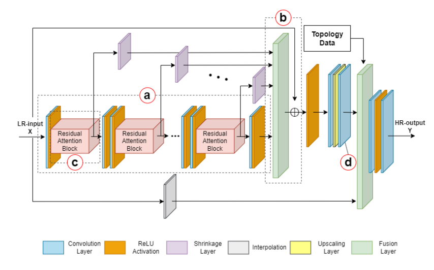
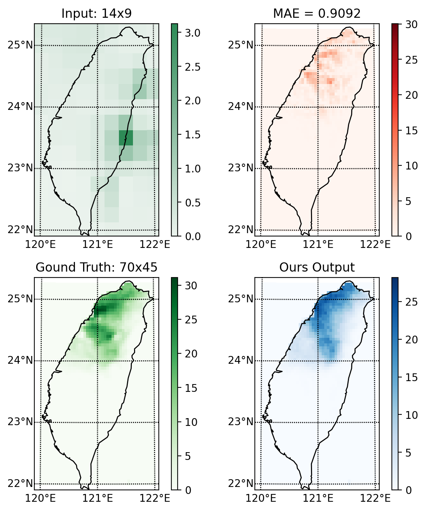

# Deep-learning Based Climate Downscaling
Deep-learning Based Super-resolution Model in Climate Downscaling of Precipitation Data: this is the source code of [Climate Downscaling: A Deep-Learning Based Super-resolution Model of Precipitation Data with Attention Block and Skip Connections](https://arxiv.org/abs/2403.17847).

National Taiwan Normal University 110 sememster

Advisor: Ko-Chih Wang

Author: Chia-Hao Chiang

## Model Architecture
Composed of CBAMs (channel attetnion, spatial attention block), convlutional layers, and upsampling layer (Subpixel manner).

## Purpose
To generate high-resolution precipitation data in Taiwan. Check the links below for more data information:

- Training input: [ERA5 Reanalysis Data](https://cds.climate.copernicus.eu/cdsapp#!/dataset/reanalysis-era5-single-levels?tab=overview)

- Label (ground truth): [TCCIP Observations](https://tccip.ncdr.nat.gov.tw/ds_03.aspx)

## Usage
### setting
Set your own parameters in `config.ini` and put your training dataset in the folder: `data/input/`, which should have the naming of `*yyyymmdd.npy`!

Similarly, put your label data (ground truth) dataset in the folder: `data/label/`, which should also have namings of `yyyymmdd.npy`.

The `dataloader.py` is constructed based on the file namings and therefore they have to contain `*yyyymmdd.npy` suffix.

### training
Direct to the root folder of `main.py` and then just run it: `$ python main.py`. 
The model would be saved in the `model_save_dir` set in `config.ini`, by default, at `weights/`.

### prediction
After put the inputs you want to predict into the folder: `pred_inputs/`
just run `pred.py`: `$ python pred.py`. The results will be saved in the folder: `pred_results`.
The paths of inputs and outputs for inferencing are defined as `pred_input_dir` and `pred_save_dir` in `config.ini`

## Showcase
Prediction on the date in 2019.03.25:

## Folders

- **data**
Contains the dataset for training.

NOTICE THAT: all namings are currently hard-coded to be used in the format of `*yyyymmdd.npy`.

- **model_utils**
Contains 4 .py files:
1. `dataloader.py`, as it's named, pulls chunks of training data paths and load one batch of training data via `np.load(path).` 
2. `MyLayersNonSeq.py` contains some module or layer blocks.
3. `MyModelsNonSeq.py` assembles the layers or blocks from `MyLayers.py` to construct models.
4. `train.py` build training class and training related functions.

- **pred_input**
When operating in the inference mode, that is, running the `pred.py`, put the input you want to feed here.

- **pretrained_results**
When operating in the inference mode, that is, running the `pred.py`, the prediction is saved here.

- **pretrained_weights**
The pre-trained weights by the author.

- **results**
where the loss histories are stored.

- **weights**
where the model weights are stored when running `main.py` to train your own.

## Environment
Update the `environment.yml` file. Run `$ conda env create -f environment.rml` to install the environment (env default name = climate). This may take minutes.

- platform: Windows11
- python == 3.9.19
- tensorflow == 2.15.0
(tested on 2024.08.19)

- platform: Windows10
- python == 3.10.3
- tensorflow == 2.12.0
(tested on 2023.07.05)